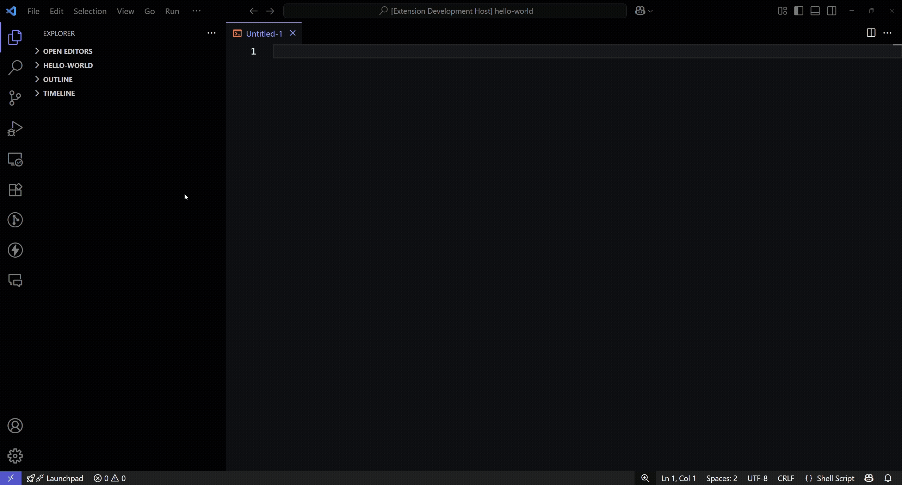

# Ansible PowerMax Snippets

**Ansible PowerMax Snippets** is a Visual Studio Code extension that allows you to quickly search and insert Dell EMC PowerMax Ansible snippets directly into your editor. This extension helps you automate storage management tasks by providing ready-to-use, trusted Ansible playbook examples for PowerMax arrays.

## Features

- Search for Ansible snippets by keyword or description.
- Insert PowerMax Ansible tasks into your playbooks with a single click.
- Supports multiple PowerMax Ansible collection versions (3.1.0 and 4.0.0).
- Snippets cover common storage operations: provisioning, masking, snapshot, replication, and more.



## Installation

1. Open **Visual Studio Code**.
2. Go to the **Extensions** view (`Ctrl+Shift+X`).
3. Search for `Ansible PowerMax Snippets`.
4. Click **Install**.

## Usage

1. Open a YAML or Ansible playbook file in VS Code.
2. Open the Command Palette (`Ctrl+Shift+P` or `Cmd+Shift+P` on Mac).
3. Type and select:
   - `Search Dell EMC PowerMax Ansible Snippets - v4.0.0`  
   - or `Search Dell EMC PowerMax Ansible Snippets - v3.1.0`
4. Search for a snippet by keyword or description.
5. Select a snippet to insert it at your cursor location.

## Example Snippet

Example of a snippet inserted by this extension:  

```yaml
- name: Create volume
  register: result
  dellemc.powermax.volume:
      unispherehost: "{{ unispherehost }}"
      verifycert: "{{ verifycert }}"
      user: "{{ user }}"
      password: "{{ password }}"
      serial_no: "{{ serial_no }}"
      vol_name: "{{ vol_name }}"
      sg_name: "{{ sg_name }}"
      size: 1
      cap_unit: "{{ cap_unit }}"
      append_vol_id: "{{ append_vol_id }}"
      state: 'present'
```

## References

- https://galaxy.ansible.com/ui/repo/published/dellemc/powermax/
- https://github.com/dell/ansible-powermax/

## Author

Developed and maintained by [Rajesh V U](https://www.rajeshvu.com)

## License

MIT License

